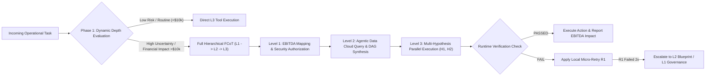

# KKR Enterprise Agent Platform: Value Proposition & Strategic Architecture Report

> **Platform:** 3-Tiered Flexible Chain of Thought (FCoT) Multi-Agent Autonomous Engine  
> **Foundation:** Google Cloud Agentic Stack & Gemini Enterprise Platform (Gemini 2.0 / Vertex AI)  
> **Target Audience:** KKR Operating Partners, Portfolio Executives, & Technology Leaders  

---

## Executive Summary: The Value Proposition for KKR

Private equity value creation relies on rapidly expanding EBITDA ($\Delta\text{EBITDA} = \Delta\text{Revenue} - \Delta\text{OPEX}$) across diverse portfolio companies without incurring years of technical debt, costly backend re-architecting, or requiring scarce AI research talent at each asset.

The **3-Tiered FCoT Enterprise Agent Platform** delivers a **turnkey, low-code operational engine** designed specifically to tackle the unique structural challenges of private equity portfolio operations:

```mermaid
graph TD
    subgraph S1["Executive Steering"]
        A["Level 1: Strategic & Executive Steering - EBITDA Optimization & Zero-Trust Governance"]
    end
    
    subgraph S2["Domain Integration Layer"]
        B["Level 2: Domain Blueprint & Integration - Agentic Data Cloud - Zero Schema Refactoring"]
    end

    subgraph S3["Operational Execution Layer"]
        C["Level 3: Operational Action & Execution - Parallel Hypotheses, Self-Healing R1, API/RPA"]
    end

    A -->|"Strategic Intent & EBITDA Metrics"| B
    B -->|"Workflow DAGs & Schema Translation"| C
    C -.->"Self-Correction Escalation R1 -> L2 -> L1"| A
```

### Key Value Pillars for KKR Portfolio Companies

| Challenge | Legacy Approach | KKR Agentic Engine Solution | Financial & Operational Impact |
| :--- | :--- | :--- | :--- |
| **AI Talent Deficit** | Hiring dedicated AI ML research engineers per asset ($500k+/yr). | Pre-built reusable **Blueprints** & self-healing agent topologies. | **80% reduction** in deployment overhead; 60–90 day time-to-value. |
| **Heterogeneous Tech Debt** | Full ERP/CRM rewrite (2–3 years, $10M+ risk). | Grounding via **Agentic Data Cloud** federated semantic layer over AS400, SAP, Epic EHR, Oracle. | **Zero legacy backend refactoring** required. |
| **Unpredictable AI Behavior** | Unconstrained LLM wrappers with hallucination risk. | **3-Tier Governance & FCoT Protocol** with automated HITL gates for transactions > $25k. | **Zero-Trust active runtime compliance** and deterministic validation. |
| **EBITDA Acceleration** | Incremental process tweaks; manual back-office tasks. | Autonomous multi-system transaction resolution. | **$1.2M–$2.8M annual OPEX savings** per portfolio company asset. |

---

## Detailed Architectural & Operational View

The platform operates across three explicit operational tiers, governed by the **Flexible Chain of Thought (FCoT)** reasoning engine.



### Tier 1: Executive & Strategic Steering Layer
* **Specialized Agents:** `EBITDA-Optimizer-Agent`, `Portfolio-Governance-Overseer`
* **Function:** Translates operational goals into quantifiable financial targets ($\Delta\text{OPEX}$ vs $\Delta\text{Revenue}$) and enforces zero-trust governance limits.
* **Key Mechanisms:**
  * Establishes strict SLA parameters.
  * Triggers mandatory **Human-In-The-Loop (HITL)** authorization for transactions exceeding financial bounds (e.g., claims/invoices > $25,000).

### Tier 2: Domain Blueprint & Integration Layer
* **Specialized Agents:** `Workflow-Decomposer-Agent`, `Agentic-Data-Bridge`, `Schema-Translator`
* **Function:** Bridges strategic blueprints into execution-ready DAGs (Directed Acyclic Graphs) over legacy infrastructure.
* **Key Mechanisms:**
  * Queries the **Agentic Data Cloud** semantic layer (BigQuery & Vertex AI Extensions) without locking or modifying underlying legacy databases.
  * Dynamic schema transformation mapping heterogenous inputs (SAP S/4HANA, Salesforce, AS400, Epic EHR, Oracle) into unified JSON payloads.

### Tier 3: Operational Action & Runtime Execution Layer
* **Specialized Agents:** `FDE-Action-Runner`, `Tool-Execution-Worker`, `Runtime-Verification-Guard`
* **Function:** Executes transactional updates via APIs, database operations, or RPA automation.
* **Key Mechanisms:**
  * **Parallel Hypothesis Branching ($H_1, H_2, \dots$):** Evaluates competing operational paths simultaneously (e.g., entity extraction vs entity + historical cross-reference) and selects the winning path based on confidence scores.
  * **Real-Time Verification & Self-Healing ($R_1$):** Validates payload schema integrity in real-time. Automatically applies local micro-retries ($R_1$) or escalates back up the tier hierarchy upon unhandled edge cases.

---

## Concrete Portfolio Value Walkthroughs

### 1. Healthcare Asset – Claims Processing & Authorization
* **Problem:** High manual processing times (96 hours per claim), legacy AS400 core system, severe shortage of medical coders.
* **FCoT Resolution:**
  * **L1 Strategic:** Reduced pre-authorization cycle latency from **96 hours to < 10 minutes** ($\Delta\text{OPEX} = \$1.2\text{M}$ annual savings).
  * **L2 Integration:** Federated query across AS400 terminal emulator API and Epic EHR FHIR endpoints via Agentic Data Cloud.
  * **L3 Execution:** Parallel hypothesis evaluation ($H_2$ selected at 97% confidence matching ICD-10 codings against historical BigQuery approvals).

### 2. Manufacturing & Logistics Asset – Accounts Payable 3-Way Matching
* **Problem:** 8.5% invoice mismatch error rate across legacy SAP S/4HANA and Oracle Cloud PO lakehouses.
* **FCoT Resolution:**
  * **L1 Strategic:** Target zero invoice processing backlog; **$450k annual AP operational cost reduction**.
  * **L2 Integration:** `Procurement_Invoice_Matching_v3` blueprint queries PO lakehouse without backend refactoring.
  * **L3 Execution:** Detected 2% tax discrepancy; dynamically applied reconciliation rule $R_1$ to complete 3-way match without manual intervention.

---

## Strategic Summary for KKR Operating Partners

The **3-Tiered FCoT Multi-Agent Autonomous Engine** provides KKR with an institutional unfair advantage:
1. **Rapid Time-to-Value (60–90 Days):** Immediate EBITDA expansion without waiting for multi-year digital transformation projects.
2. **Capital Efficiency:** Standardizes AI deployment across portfolio companies using reusable domain blueprints.
3. **Enterprise Control & Safety:** Enforces strict financial governance and zero-trust security limits while operating dynamically at scale.
